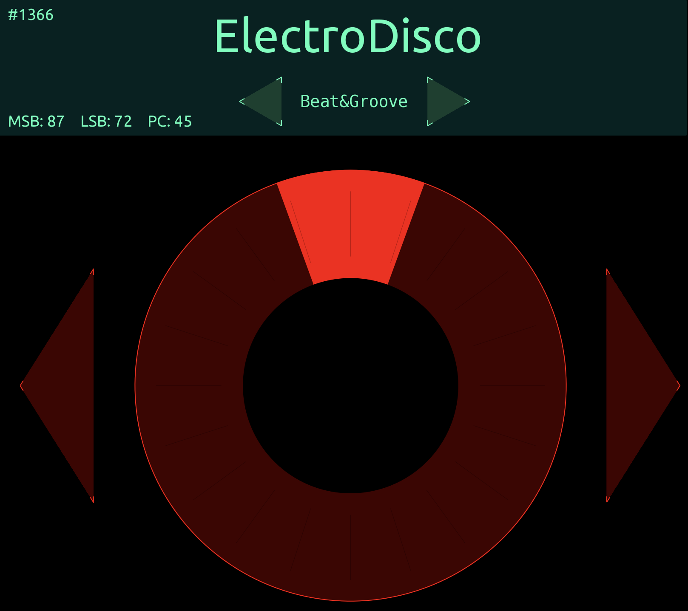
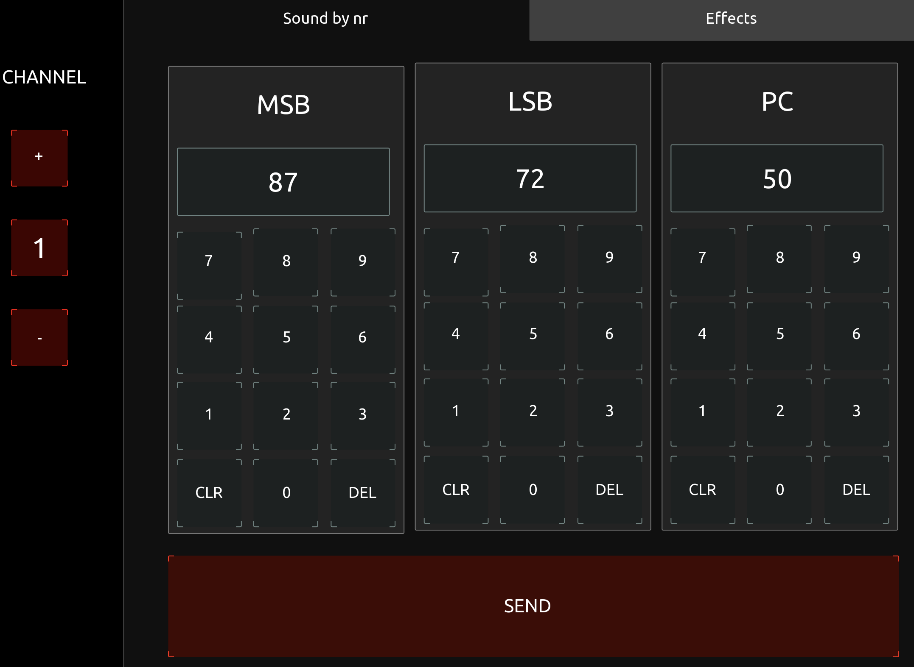

## TouchOSC Templates for GO:KEYS and GO:PIANO

This directory contains TouchOSC templates to help you easily browse and select patches on your GO:KEYS or GO:PIANO keyboard.

## What is TouchOSC?

TouchOSC is a software application that transforms your smartphones, tablets, and computers into highly customizable control surfaces.

Learn more and download it here: https://hexler.net/software/touchosc

## Templates

- **GO-wheel.tosc**: A jog wheel interface for intuitive patch browsing.
- **GO-numpad.tosc**: A numeric keypad for direct patch selection by number.

## Getting Started

1. **Download TouchOSC:** Available for desktop (free) and mobile devices (iOS and Android versions require purchase).  Get it here: https://hexler.net/touchosc#get
2. **Load the template:** Transfer the desired .tosc file to your device and open it in TouchOSC.
3. **MIDI Setup:** Select your GO:KEYS or GO:PIANO as the MIDI output within TouchOSC. Bluetooth MIDI is recommended for a wireless experience, but a standard USB cable also works.

## Using the Templates

- **Wheel:** Turn the jog wheel or use the arrows to navigate patches.
- **Numpad:** Directly enter the patch number using the keypad.

## Tips for iPad/iPhone

- Bluetooth MIDI Apps: Download a free app like "Bluetooth MIDI Connect" (Korg) or "Conji" to manage connections easily.
- Transferring Templates:
    - Connect your computer and iOS device to the same Wi-Fi network.
    - Enable the network server in TouchOSC on your computer (it has a WiFi-like icon in the rightmost part of the toolbar).
    - Connect your iPad/iPhone to the TouchOSC server and load the template.
    - Save the layout locally on your iOS device for future use.
    
## Screenshots

## Additional Notes

Refer to the TouchOSC documentation for in-depth usage: https://hexler.net/docs/touchosc

